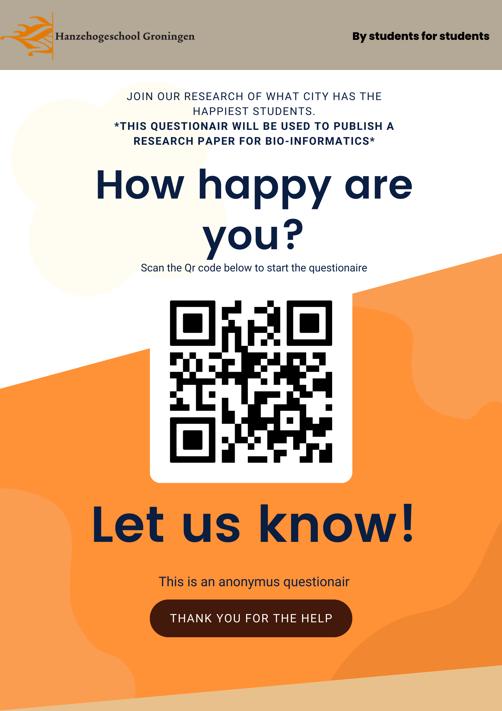
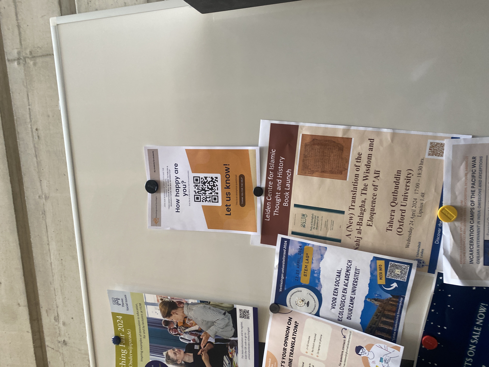

```{r setup, include=FALSE}
knitr::opts_chunk$set(echo = TRUE)
```

```{r}
library(fmsb)
library(ggplot2)
library(dplyr)
library(pwr)
library(tidyverse)
```


## tips
algemene introductie mist
Begin van de dag je doel al hebben en dat beschrijven per dag.
Heel erg in de diepte gaan van hoe het process verloopt. *STAP BIJ STAP*
Waarom, Hoe (zoektermen op googlescholar), Waarmee + uitkomst (critisch interpreteren - beschrijven van alles wat daarbij hoort)
Beredeneringen om waarom je dit uitvoert op de manier waarop je het doet. (gedachte gang)
literatuur lijst + kleine samenvatting waarom hij wel geschikt is (laat dingen zien uit het artikel)

## template-Elke dag

Doel vandaag
**Vinden bronnen**

- Task 1
- Task 2
- Task 3

Waarom wil je bronnen - literatuur vinden (gedachte gang ook waarom voer je het uit op manier dat je het doet. dus de gedachte gang)
Hoe heb je de bronnen - literatuur gevonden
Waarmee en wat heb je gevonden (critisch uitleggen waarom gebruik je dit en wat voegt dit toe aan je onderzoek.)


## 22-04-2024

### Doel van de dag

**Opzetten onderzoek + voorbereidingen**

Tasks

- Team maken 
- De Vraag bedenken
- De Vraag laten goedkeuren door 1 van de leraren
- Plan maken hoe en waarmee we het onderzoek gaan doen

Ik heb een groepje gemaakt met Storm. Wij samen dachten eerst aan het onderzoeken van dingen die iets met sporten te maken hebben. Dit was echter niet mogelijk door budget en grote van steekproef.

Wij hebben toen gedacht om iets te onderzoeken wat met mentale gezondheid heeft te maken. Hierover zijn we gaan sparren en we kwamen uit op Geluk. Wij hebben daarna met de leraar staan praten die ons heeft geholpen met het meer een vraag maken. We denken hoe kan je geluk nou vergelijken. Als je kijkt naar verschillende steden heb je al een factor, Wanneer je kijkt naar steden die specifiek met studenten hebben te maken zit je in een kleiner veld wat goede resultaten zou kunnen werven. Ik stel voor om te kijken tussen de verschillen in geluk van de studenten steden. Hier zijn we het beiden over eens. We zoeken op google naar "Welke steden zijn studenten steden" We komen op de volgende website https://www.hallmark.nl/magazine/huis/de-leukste-studentensteden-van-nederland/ (22-04-2024)
Hier op staat een top 10 lijst met steden. Wij halen er uit dat Groningen, Leiden, Utrecht boven aan staan en dus nemen we deze in ons lijstje op Amsterdam staat lager en deze nemen we dus ook mee. Dit omdat er ook naar studenten steden moeten gekeken worden waar het niet compleet alleen voor de studenten is.
Ik opende ook de website van https://www.studiekeuzelab.nl/kies/welke-studentenstad-past-bij-mij-top-5 (22-04-2024) dit is een studie keuze website waar dus ook allemaal studenten steden op stonden. Ik zag dat hier dezelfde steden ook weer opstonden echter stonden deze niet op een top 10 volgorde. Hierdoor heb ik met storm overlegt en we houden het bij deze steden. Leiden, Groningen, Utrecht en Amsterdam. 

Het Doel van de dag is dus Redelijk behaald. De onderzoeksvraag is half gevonden maar moet nog worden uitgewerkt verder

De Tasks

- Team maken = Gedaan
- De Vraag bedenken = Gedaan
- De Vraag laten goedkeuren door 1 van de leraren = Half gedaan
- Plan maken hoe en waarmee we het onderzoek gaan doen = nog niet af

## 23-04-2024

### Doel van de dag
**Het afmaken van de onderzoeksvraag & meet methode vinden.**

Tasks

- Onderzoeksvraag beter en duidelijker maken
- Verschillende methoden bekijken waarmee we geluk kunnen meten
- Wat is nodig voor deze methoden
- Wat is het eind doel?

Ik heb samen met storm besproken hoe we de hoofdvraag moeten formuleren. We zijn gaan brainstormen met de keywords. "Studenten", "Geluk", "Stad / Studentenstad" Hier kwamen een aantal vragen uit.

- Welke stad heeft de gelukkigste studenten
- Waar zijn studenten het gelukkigste
- In welke studenten stad zijn studenten het gelukkigste?

Na het praten met de leraar hebben wij besloten om **“In welke studenten stad zijn studenten het gelukkigst?“**
Als onze onderzoeksvraag te gebruiken. 

De hyptothese en 0-hypothese moeten we hiermee ook maken. De hypthose waar we op komen is: Het maakt voor het geluk van de student niet uit in welke stad deze studeert. De gedachte gang hier achter is dat een stad niet bepaald hoe gelukkig iemand is de algemene ervaring is dus het leidende.

Nu gaan we kijken wat hebben we nodig en hoe gaan we deze vraag beantwoorden. Storm en ik hebben wat onderzoeks methoden bekeken https://www.scribbr.nl/category/onderzoeksmethoden/ (23-04-2024) deze website heeft ons een paar ideeën gegeven, ook hebben wij onze leraar gevraagd die met ons sparde met wat past
De opties die er uitkwamen waren een test op cortisol of een enquete. De cortisol test was echter te duur en complex. Dus was de enquete de keuze die Storm en ik samen hebben gemaakt. De enquete produceerd een csv data file die makkelijk in r is te importen dit kan met de volgende functie:

```{r}
# read.csv()
```

De enquete heeft een paar voorwaarden: De vragen moeten duidelijk zijn, De manier van antwoorden moet een datatype terug geven waarmee gemidelden en grafieken etc mee kunnen worden uitgerekend. De verspreiding van de enquete is een belangrijke beslissing. 

De vragen die in de enquete zullen staan moeten de hoofdvraag **“In welke studenten stad zijn studenten het gelukkigst?“** beantwoorden. Dus moeten wij onderzoeken welke factoren geluk bepalen en welke er aan toevoegen of afnemen. Dit moeten wij doen door het lezen van literatuur over geluk, Situatie en moleculaire werking.

## 24-04-2024

### Doel van de dag
**In de literatuur kijken naar wat en hoe**

Tasks

- Kijken naar literatuur
- Samenvatting geven van wat ik heb gevonden
- Kijken hoe ik deze info kan vertalen naar vragen


ik ben gaan kijken naar de literatuur. Ik begon met google scholar. De volgende zoek termen heb ik gebruikt. *What is happiness*, *How does happiness work*, *Moleculair working of happiness*, *Happiness in people*
Google scholar heeft mij boeken en wetenschappelijke artikellen gegeven. 

- Jacobsen, B. (2007, 1 januari). What is Happiness? | Existential Analysis: Journal of the Society for Existential Analysis.
- Easterlin, R. A. (2003). Explaining happiness. Proceedings Of The National Academy Of Sciences Of The United States Of America
-Veenhoven, R. (1991, 1 januari). Questions on Happiness.

- De abstract van What is Happiness? | Existential Analysis: Journal of the Society for Existential Analysis. zegt het volgende. "Happiness as experienced by ordinary people has been the object in both sociological and psychological studies. The concept of happiness used in the studies of Positive and Humanistic Psychology varies from subjective well-being, to the fulfilment of life goals. In Existential Psychology the concept of happiness has both bodily and spiritual dimensions. In this paper the concept of happiness will be analyzed and the use of it in existential psychology and therapy will be discussed. The contributions to the field of Buhler, Boss, Condrau, Heidegger and May will be examined to throw light on a vital phenomenon concerning us all."

n deze paper wordt naar het concept "Geluk" gekeken dit houd in dat er wordt gekeken naar meerdere kanten van geluk bekijken. Waaronder het concept van geluk. Hoe het in de maatschappij werkt, in de Humanistische psychologie en het effect van geluk op de levens van mensen. Deze tekst is gekozen omdat het een diepe kijk neemt door de ogen van een socioloog. het heeft goede punten en veel info die relevant is zoals de manier waarop verschillende factoren invloed hebben op iemands geluk.


- Explaining happiness. Proceedings Of The National Academy Of Sciences Of The United States Of America.
zegt in zijn abstract het volgende: "What do social survey data tell us about the determinants of happiness? First, that the psychologists' setpoint model is questionable. Life events in the nonpecuniary domain, such as marriage, divorce, and serious disability, have a lasting effect on happiness, and do not simply deflect the average person temporarily above or below a setpoint given by genetics and personality. Second, mainstream economists' inference that in the pecuniary domain "more is better," based on revealed preference theory, is problematic. An increase in income, and thus in the goods at one's disposal, does not bring with it a lasting increase in happiness because of the negative effect on utility of hedonic adaptation and social comparison. A better theory of happiness builds on the evidence that adaptation and social comparison affect utility less in the nonpecuniary than pecuniary domains. Because individuals fail to anticipate the extent to which adaptation and social comparison undermine expected utility in the pecuniary domain, they allocate an excessive amount of time to pecuniary goals, and shortchange nonpecuniary ends such as family life and health, reducing their happiness. There is need to devise policies that will yield better-informed individual preferences, and thereby increase individual and societal well-being." 

In deze paper wordt gekeken naar sociale enquêtes en wat deze data zegt over de omstandigheden van geluk. Er wordt ook gezegd dat Psychologen hun model twijfelachtig is en dat het bepaalde levens omstandigheden en levens gebeurtenissen niet in zich opneemt. Dit zijn dan getrouwd zijn of scheiding. Ook bijvoorbeeld een zware onbekwaamheid of mentale worsteling zoals depressie of adhd. Deze hebben een langdurig effect op hoe een persoon geluk ervaart. Deze paper is dus belangrijk voor ons onderzoek dit omdat er factoren in staan die ook moeten worden meegenomen. Dit zijn dus bijvoorbeeld: Mentalegezondheid, Thuis situatie, Voel je je op je plek in de stad waarin je woont (Soms is het moeilijk om in een nieuwe stad te leven vooral als een eerste jaars), Of iemand een international is. Weg zijn van je ouders en je huis waar je niet zomaar terug naar toe kan is ook een mentale druk die je geluk langdurig kan aantasten.

Met deze denkwijze hebben wij daarom gekozen om deze paper te gebruiken.

- Questions on Happiness. De introductie zegt het volgende "Happiness is a longstanding theme in Western thought. It came under scrutiny in the following three periods: (1) Antique Greek philosophy; (2) Post-Enlightenment West-European moral philosophy, Utilitarianism in particular; and (3) Current Quality-of-Life research in the rich welfare states. Printed reflections on all this contemplation now fill a hundred meters of bookshelves. This paper takes stock of the progress made on seven classical topics. Are we now any wiser? Or is Dodge (1930) right in his contention that “the theory of the happy life has remained on about the same level that the ancient Greeks left it”? This inventory will differ from the usual review articles. The focus will not be on current technical research issues, but rather on the broader questions that prompted the enquiry. Furthermore, the aim is not only to enumerate advances in understanding, but also to mark the blind spots."

Hieruit kan worden opgemaakt dat er naar verschillende perioden wordt gekeken. Dit zijn de antieke Griekse filosofie, De Na-verlichting west europeese morale filosofie, "Utilitarianism" specifiek en de huidige kwaliteit van leven onderzoeken in rijke welvarende staten. deze paper bekijkt het in de progressie van 7 klasieke onderwerpen 

The following issues will be considered:

1. What is happiness?
2. Can happiness be measured?
3. Is unhappiness the rule?
4. How do people assess their happiness?
5. What conditions favour happiness?
6. Can happiness be promoted?
7. Should happiness be promoted?

Deze onderwerpen geven ons goeie informatie om vragen op te bouwen. ook wordt er bijvoorbeeld in het onderwerp "Can happiness be measured" sub onderwerp "Assesment by quetstioning" besproken of een enquête wel een goed beeld weergeeft en of mensen zelf wel kunnen zien of ze gelukkig zijn of niet. Echter vinden de onderzoekers dat mensen meestal wel bewust zijn van het genot van hun leven. Als we naar de conclusie kijken bij onderwerp 5 wordt verteld dat er weinig kennis en onderzoek is over welke voorwaarden zorgen voor een positieve waardering van het leven. 

Na deze tekst te lezen ben ik tot de conclusie gekomen dat een enquête een goede manier is om geluk te meten van de studenten, dat de factoren die we uitzoeken onderbouwt moeten worden met onderzoek en dat het dan alsnog niet helemaal zeker een goeie meting is omdat de voorwaarden nog best onbekend zijn

Uit deze literatuur kan ik een paar vragen halen.
Ik zie dat de vragen moeten bestaan uit een deel omgeving hiermee wil ik zeggen vragen naar iemands omgeving. Dit kan zijn de stad waarin iemand woont en of ze hier te vreden zijn. Hun woonsituatie dit houd in huis en huisgenoten of ouders + broers en zussen. 

Ik heb met storm nog besproken hoe wij de enquete gaan maken (dit is via een call gesprek gegaan) en we gaan hier ook nog verder naar kijken maar voor nu is google forms de beste optie die wij hebben kunnen vinden. Dit omdat google forms anoniem kan zijn dit doe je door bepaalde instellingen aan te passen. Verder heeft google forms de mogelijkheid om een csv document te generen dit is handig voor ons want dan is onze data al mooi geformat en hoeven wij alleen voor NA's te controleren (NA's kunnen voor conflicten zorgen wanneer je plotjes maakt.)

## 26-04-2024

### Doel van de dag
**enquete vragen maken en structuur van de enquete bepalen**

Tasks

- Door middel van het kijken naar de gevonden literatuur vragen maken
- Vragen onderbouwen met literatuur waarom dit een goede vraag is
- Enquête structuur bedenken

Gister heb ik me verdiept in de literatuur, dit waren de papers van Jacobsen, B. (2007, 1 januari). What is Happiness?, Easterlin, R. A. (2003). Explaining happiness en Veenhoven, R. (1991, 1 januari). Questions on Happiness.

### Deze literatuur heeft me gebracht op wat vragen

- Hoe gelukkig voel je je nu. Deze vraag hebben we er in gezet om gelijk een niveau te krijgen. Dit voor dat de student de vragen gaat beantwoorden. Dit doen we omdat het kan zijn dat de student tijdens de vragen gaat nadenken over dingen en dit kan invloed hebben op iemands geluk. Bijvoorbeeld een vraag over of iemand een goede relatie met zijn ouders heeft zou negatieve heringeringen kunnen oproepen waarmee ze de rest van de enquete mee kunnen zitten. 

- Ben je gelukkig met je fysieke gesteldheid. De fysieke gesteldheid is per persoon anders qua invloed op het geluk. Wanneer we kijken naar mensen die veel sporten is er een mentale aandoening genaamd "Body Dysmorphic Disorder" ook wel body dysmorphia. Deze mentale aandoening kan in lichte en zwaardere vormen voorkomen. De reden dat we deze specifiek benoemen is omdat deze vrij vaak voorkomt in de groepen tieners - jong volwassenen. Het komt er op neer dat een persoon met body dysmorphia vaak zichzelf slechter ziet dan wat werkelijkheid is. Dit kan een langdurig effect hebben op iemands mentale gezondheid en geluk. 

- Hoe belangrijk is je (fysieke-) gezondheid voor je geluk? Deze vraag is om te kijken hoeveel waarde iemand hecht aan zijn fysieke gezondheid dit kunnen we samen paren met de vorige vraag. Het is bekend dat er veel studenten sport verenigingen zijn en dus zouden sommige studenten die hier veel aanhechten ook veel aan hun fysieke gesteldheid hechten. Wanneer bijvoorbeeld een student bij een vereniging zit voor roeien en deze krijgt een blessure waardoor hij en zijn team niet mee kunnen doen aan een wedstrijd. Zou dit kunnen leiden tot een schuld gevoel waardoor dus het extra belangrijk is voor zijn geluk dat hij een goede fysieke gesteldheid heeft. Daarom stellen we deze vraag.

**Deze vragen over fysiek geluk en waarom dit belangrijk is zijn terug te vinden in de paper van Veenhoven, R. (1991, 1 januari) onder het kopje "HOW DO PEOPLE ASSESS THEIR HAPPINESS?" - Most questions and speculations about the inner fabrication of happiness concern mental processes. Yet it is widely acknowledged that a physical substrate is involved as well.** 

Dit verteld ons dus dat het fysieke deel van iemand ook invloed heeft op het geluk.


- Hoe belangrijk is contact buiten school met andere voor jouw geluk? Wanneer we kijken naar wat een mens nodig heeft dan komt sociaal zijn met andere mensen hoog voor op de lijst. In de paper van Veenhoven, R. (1991, 1 januari) hoofdstuk - Can happiness be learned? wordt er ons het volgende verteld "two comprehensive attempts to influence happiness by cognitive retraining have been reported (Lichter et al., 1980; Fordyce, 1977). These “happiness courses” required subjects to practice self-suggestion of happiness, to lower their aspirations and to engage more in behaviour already proven to be beneficial, such as socializing. Experimental groups showed improvement in happiness over control groups. None of these follow ups cover more than a few months. Hence, it is not yet clear whether happiness can be boosted permanently in this way." Wat hier wordt gezegd is dat in een experiment waar mensen worden her opgeleid in het sociale vlak door bijvoorbeeld te gaan "socializing" er toch een verhoging in iemands geluk komt. Deze experimenten waren niet heel lang dus het is niet bewezen hiermee of dit een langdurig effect is. Om deze reden nemen we deze vraag mee in onze enquete omdat een goede sociale omgeving en "socializing" dus (tijdelijk-)geluk kan veranderen.

- Ik vind het belangrijk om buitenschool sociale activiteiten te doen. Dit is in combinatie met de vorige vraag. De gedachte hier achter is om te kijken hoe belangrijk het sociale contact is voor iemand zodat we kunnen speculeren of deze persoon meer een introverte of extroverse persoonlijkheid heeft. Dit geeft ons weer meer een perspectief over ons eind oordeel voor deze enquete.

- Ik heb een goede relatie met mijn ouders. Deze vraag is om te kijken wat de band is van de student met zijn ouders. Dit komt omdat in de paper van Easterlin, R. A. (2003). Explaining happiness. werdt genoemd dat sommige factoren een langdurig effect kunnen hebben op iemands geluk. in het sub-hoofdstuk over explaining happiness wordt het volgende gezegd "Life circumstances other than those discussed here, such as friend-ships, work, and employment status, affect happiness too, but income, family, and health conditions are typically cited most often by people as sources of happiness (56)." Hierin zien we dus dat volgens de paper family vaak wordt genoemd als een bron van geluk. Deze vraag die dus naar een deel van de familie vraagt is daardoor dus niet te missen.

- Ik ben gelukkig met mijn woonsituatie. Deze vraag is weer om te kijken naar een externe factor die iemands algemene geluk zou kunnen beïnvloeden. De vraag gaat alleen om degene zijn woonsituatie met betrekking tot huisgenoten, het huis zelf en dus niet de stad waarin deze student woont.

Het antwoorden van deze vragen moet op een bepaalde manier zodat hier een netjese grafiek uit kan worden gehaald. Ik heb aangegeven bij mijn groepsgenoot dat een cijfer van 0-5 of 0-10 goede opties zijn omdat deze bekend zijn en vaak worden gebruikt in enquetes die een duidelijke mening moeten weer geven. Ik heb met mijn teamgenoot het besproken en wij zijn uitgekomen op de 0-10 beantwoordings methoden. Dit omdat 0 = 0% en 
10 = 100%. 

### Protocol

Wij hebben ook dit protocol geschreven. 

Door middel van een QR-code kan de student deze scannen en een Google form invullen met de vragen. De vragen hebben een schaal van 0-10 waarbij 0 het slechtste is en 10 het beste. De flyers nemen de meters mee naar de Universitaire bibliotheken van de studenten campussen om zoveel mogelijk verschillende studenten te ondervragen.  

De enquête wordt ook op plekken rond de campus opgehangen. Dezelfde posters als die we aan de studenten laten zien. De link van de enquête zal eventueel nog worden gemailed naar studies / scholen zelf. Dit is zodat we een groot genoege groep kunnen krijgen zodat er genoeg data is. Ook om te zorgen dat de populatie willekeurig is en niet zwaar wordt beïnvloed door 1 bepaalde groep. 


## 29-04-2024

### Doel van de dag
**Posters ophangen in leiden*

Tasks

- In de gebouwen van de Universiteit leiden, LUMC en de hogeschool van leiden posters ophangen
- Mensen werven voor de enquetes
- Emails verzamelen 

Poster gemaakt door Storm


**De poster is door storm gemaakt - ik heb alleen na gelopen en suggesties over de verwoording gemaakt.**

Om zoveel mogelijk data te krijgen zijn wij zo snel mogelijk naar de gekozen steden gegaan. Leiden was het verste weg dus deze gaan wij als eerste heen. Wij begonnen met posters ophangen om 13:30. Dit was in het lipsius gebouw, we gingen elk gebouw af waar we 2-3 posters ophangen. Dit deden we in de mei vakantie. Wij denken echter dat dit niet een enorme invloed zou moeten hebben op hoeveel data we kunnen verkrijgen. Dit omdat de universiteiten niet aan de mei vakantie doen en het dus in elk universiteits gebouw waar we waren het druk is. Het hbo en mbo hebben wel deze vakantie maar ondanks dat zijn we wel binnen gelaten in het hbo gebouw en hebben wij hier ook 3 posters opgehangen.

Hier onder is te zien hoe een opgehangen poster er uit ziet op een poster bord.

Tijdens deze posters op hangen hebben wij ook geprobeerd studenten aan te spreken. Deze geven ons helaas het antwoord "Ik moet naar de les sorry" of "Ik heb geen tijd". Wij merken dus dat deze studenten er niet voor open staan om 3 minuten de tijd te nemen om onze enquête te beantwoorden.

Bij de service balies hebben wij ook gevraagd of ze deze konden laten zien aan of ophangen. Dit kan echter niet maar ze gaven ons wel het idee meerdere keren om te emailen. Het emailen van de uni zelf, de facultiteit, studie & studenten verenigen. 

We zijn ook nog naar het LUMC gegaan omdat hier toch ook veel studenten komen hier hebben we maar 2 posters opgehangen omdat we niet het gehele ziekenhuis door mochten en er weinig poster borden zijn.

## 07-05-2024

### Doel van de dag
**Posters ophangen in Utrecht*

Tasks

- In de gebouwen van de Universiteit Utrecht & Hogeschool van Utrecht posters ophangen
- Mensen werven voor de enquêtes
- Emails verzamelen 

Vandaag zijn we in Utrecht. Hetzelfde protocol als in leiden is hier gevolgd. We zijn begonnen op de padualaan bij het gebouw van de hogeschool van utrecht. We gaan hier net als in leiden elk gebouw af en zoeken de poster borden op. We hebben nog aan de service balies gevraagt waar we de posters mogen neer hangen en dit verwees on weer naar de poster borden. 

In utrecht mogen wij ook in de studenten cafe's en de restauranten + de ub posters ophagen. Dit zijn plekken waar de studenten wat vaker met andere dingen bezig zijn dan alleen focus op hun lessen waardoor wij verwachten dat hierdoor de enquetes meer worden gezien!

## 08-05-2024

### Doel van de dag
**Data bekijken + Email idee uitwerken**

Tasks

- Data bekijken wat hebben we en hoeveel is genoeg
- Naar wie moeten de emails
- Email maken en in protocol zetten 

Tijdens het ophangen van de posters is ons het idee binnengeschoten om ook nog email's te sturen naar verschillende groepen. Hier onder vallen de universiteiten, Hbo's en mbo's email's zelf maar ook de studie verenigingen en misschien een paar studenten verenigingen ook de faculteiten.

De email moet netjes en profesioneel zijn zodat dezelfde email naar iedereen kan worden gestuurd. Hierdoor krijg je geen conflicten in interpretatie.

### De email is als volgt.

Hallo, **insert naam ** 

Wij Storm en Jarno zijn studenten aan de Hanze Hogeschool Groningen. Wij hebben een onderzoeks project waar wij kijken naar het geluk van studenten in verschillende studenten-steden. Wij sturen deze email om te vragen of het mogelijk is om de enquete van dit onderzoek in jullie app groep of via email te kunnen delen. De enquete  is compleet anoniem. Het moet een goed beeld kunnen schetsen over het algemene geluk van een student. Wij gaan met deze data uiteindelijk onze onderzoeks vraag beantwoorden “In welke studenten stad zijn studenten het gelukkigst?”  

Alvast bedankt voor de hulp 
 
Vriendelijke Groet 

Storm & Jarno, studenten Hanzehogeschool. 

Dit is de email en deze wordt ook nog een keer in het engels verstuurd indezelfde mail. Hiermee verwijzen we met een dikgedrukte zin **For english look below**

Ons nieuwe protocol ziet er dus ook anders uit omdat wij de email er bij hebben gezet. deze ziet er nu zo uit

### protocol met email

Door middel van een QR-code kan de student deze scannen en een google form invullen met de vragen. De vragen hebben een schaal van 0-10 waarbij 0 het slechtste is en 10 het beste. De flyers nemen de meters mee naar de Universitaire bibliotheken van de studenten campussen om zoveel mogelijk verschillende studenten te ondervragen.  

De enquête wordt ook op plekken rond de campus opgehangen. Dezelfde posters als die we aan de studenten laten zien. De link van de enquete zal eventueel nog worden gemailed naar studie’s / scholen zelf. Dit is zodat we een groot genoege groep kunnen krijgen zodat er genoeg data is. Ook om te zorgen dat de populatie willekeurig is en niet zwaar wordt beinvloed door 1 bepaalde groep. 

Om extra mensen aan te spreken en zorgen dat de enquete nog verder wordt verspreid. Dit doen we door emails te sturen naar verschillende studieverenigingen en studenten verenigingen met een link en een netjese email waarin staat wat dit onderzoek is, waarvoor en door wie. Daarnaast sturen we het ook naar de mbo-scholen en de algemene kanalen van de hbo’s en de universiteiten. De email is hier onder te vinden. 
 

## 13-05-2024

### Doel van de dag
**Opzetten Algemene document en de data van die dag bekijken**

Tasks

- Door middel van het kijken naar de gevonden literatuur vragen maken
- Vragen onderbouwen met literatuur waarom dit een goede vraag is
- Enquête structuur bedenken

### R markdown document

De structuur die wij gaan volgen is de structuur die gebruikt wordt op ncbi

Dat is als volgt

- Pakkende titel die ook goed beschrijft wat er in zit
- Een abstract met key words
- Een introductie met de hyptothese en relevantie
- De literatuur die relevant is met uitleg waarom voor dit onderzoek
- De vragen en factoren waarom deze moeten worden gebruikt
- Onze methoden en materialen - Protocol
- Resultaten
- Samenvatting
- Conclusie
- Bedankjes en Honorable mentions

Wij maken gebruik van deze template omdat wij een profesionele structuur willen weer geven in ons eindproduct.

## 14-05-2024

### Doel van de dag
**Emails verzamelen + data bekijken**

Tasks

- Emails verzamelen
- De data vanaf de google form inlezen
- Qr code verspreiden tussen klasgenoten

Ik ben bezig gegaan met het zoeken naar emails van studie verenigingen, Dit heb ik gedaan door te zoeken op google naar "Studieverenigingen *stad*" hierdoor krijg je websites zoals die van de universiteit zelf https://www.universiteitleiden.nl/onderwijs/bachelors/studentenleven/studentenstad-leiden/studentenverenigingen
of https://leidenstudentenstad.nl/studentenverenigingen waar ook nog wat opstaan. Storm heeft hier het grootste deel van de emails verzameled waar ik soms een paar nog vond.

Om makkelijk wat antwoorden te verkrijgen hebben wij een paar klasgenoten gevraagd of deze ook de enquete zouden willen invullen. Dit hebben zowel mondeling als op onze klassen discord gevraagd.

De data inlezen en bekijken. Wanneer we naar de google forms gaan is er een knop met "Bekijk in spreadsheets" Deze knop opend dan de google spreadsheet app met alle data van de vragen. Hier in click ik op de download knop en worden meerdere opties gegeven voor wat voor document ik graag wil hebben. Uit deze check bleek dat we maar 7 antwoorden hadden. Deze kwamen allemaal door onze mondelinge verspreiding en de vraag aan of de klas deze zouden willen invullen.

```{r}
# hier laad ik onze csv file in een variable genaamd student_hap_awn
student_hap_awn <- read.csv("student_hap_awn.csv")

# hier gebruik ik de "head()" command om te kijken of de juiste data typen er in zitten en de collom namen te controleren
head(student_hap_awn)

```
Nu we de data bekijken is te zien dat de collom namen heel lang zijn. Dit is niet handig om mee te werken wanneer de data moet worden verwerkt. Dit heeft meerdere redenen maar om het in het kort te zeggen. De collom namen worden soms weer gegeven op de grafiek en dit kan dus voor conflict zorgen als ze er zo uit zien en voor ons gemak om mee te werken is het moeilijk om constant deze lange strings met punten in te typen.

Hierom ga ik de colom namen aan passen met colnames() deze functie kan alle colom namen achter elkaar veranderen.

```{r}
# Er is hier te zien dat de colnames dus in volgorde worden veranderd. 
colnames(student_hap_awn) <- c("Tijd", "Sexe", "Niveau", "Opl_jaar","Vakgebied", "Woonsituatie", "Stad", "Nat_Int", "Gelovig", "Relatie_stat", "Happy_RN", "Fys_Happy", "Fys_import", "Cont_buiten_school", "Na_school_soc", "Ouder_relatie", "Woonsituatie_geluk", "Thuis_in_stad", "academische_pres", "Financiele_sit", "Geld_geluk", "Verd_mid_gebr", "drugs_alc_geluk", "Mental_health", "Happy_after_quest")

# hier head ik weer onze data om te zien of de colom namen zijn veranderd
head(student_hap_awn, n = 10)

```
Nu is de data makkelijker te lezen met de afkortingen. We zien dat de tijd tussen de eerste 6 antwoordde vrij significant is. Deze antwoorden komen ook allemaal uit Groningen. Dit betekent voor ons dat de Posters die zijn opgehangen in leiden en Utrecht geen effect hebben gehad en ons geen beantwoorde enquêtes heeft gegeven. Wij gaan dus nog meer emails sturen en op andere manieren mensen proberen te bereiken. Dit zou via sociale media kunnen of groeps chats van studenten verenigingen.

# POWER ANALYSE NOG AFMAKEN

```{r}
#hoe groot moet onze groep van gevraagde eigenlijk zijn? om 2 groepen te vergelijken gebruik je de  Independent two-sample t-test hiervoor moeten we een pwr analyze
effect_size <- 0.5
alpha <- 0.05
power <- 0.8

```


## 15-05-2024

### Doel van de dag
**Meer qr codes ophangen + overleg leraar**

Tasks

- Emails verzamelen
- De zernike campus af om qr codes te verspreiden
- Plan opnieuw bekijken

Door het lage aantal antwoorden zijn storm en ik gaan overleggen en hebben wij besloten om ons eerdere plan om de qr code te delen via onze persoonlijke sociale media en de studievereniging app groepen waar wij inzitten. Voor op onze sociale media hebben wij de posters als plaatje geplaatst. Het bericht in de app groepen ging zoals de email echter werd hier niet gevraagt of ze deze wilden verspreiden maar invullen.

Daarnaast zijn we door alle hanze gebouwen gaan lopen en hebben wij op duidelijk zichtbare plekken posters opgehangen. Deze plekken zijn poster borden, Snoep automaten, op uitgangen waar ook andere posters hingen. in bepaalde frames waar andere posters in hingen. Wij wilde deze graag duidelijker zichtbaar hebben omdat we uit de ervaring van leiden en utrecht kunnen halen dat niet veel studenten kijken naar de poster borden. Als ze dit wel doen vullen ze nog niet altijd de poster in. Vandaar deze wat andere plekken.

Toen wij aan het einde van de dag keken op hoeveel enquete antwoorden zaten was deze gestegen van de 7-8 naar de 26.


## 21-05-2024

### Doel van de dag
**Kijken welke data het belangrijkste is**

Tasks

- Data bekijken 
- Welke grafieken willen wij
- Hoe bouwen we ons eindproduct.

Als we onze data vandaag bekijken is te zien dat we op 29 antwoorden zitten.
```{r}
student_hap_awn
```


```{r}
student_hap_awn_NUM <- select(student_hap_awn, c(Happy_RN,Fys_Happy,Fys_import, Cont_buiten_school,Na_school_soc,Ouder_relatie,Woonsituatie_geluk,Thuis_in_stad,academische_pres,Financiele_sit,Geld_geluk,drugs_alc_geluk,Mental_health,Happy_after_quest))

student_hap_awn_NUM

```

Storm en ik gingen kijken naar wat voor grafieken wij willen om onze data te laten zien in ons eindproduct. de grafieken die wij waarschijnlijk gaan gebruiken zijn.

- Radarplot, Deze kan snel veel factoren laten zien en daaruit kan in een snelle blik al een mening of conclusie worden gevormd
- Scatterplot, Het scatter plot is handig om 2 groepen te vergelijken. In ons eind product willen we graag meerdere groepen met elkaar vergelijken. Dit zijn dan bijvoorbeeld sekse, Niveau, Opleidings jaar, Relatie status.

```{r}


colnames(student_hap_awn) <- c("Tijd", "Sexe", "Niveau", "Opl_jaar","Vakgebied", "Woonsituatie", "Stad", "Nat_Int", "Gelovig", "Relatie_stat", "Happy_RN", "Fys_Happy", "Fys_import", "Cont_buiten_school", "Na_school_soc", "Ouder_relatie", "Woonsituatie_geluk", "Thuis_in_stad", "academische_pres", "Financiele_sit", "Geld_geluk", "Verd_mid_gebr", "drugs_alc_geluk", "Mental_health", "Happy_after_quest")

Reactie_stad <- select(student_hap_awn, c(Stad))

ggplot(Reactie_stad, aes(x = " ", y = "Antwoord per stad", fill = Stad)) +
    geom_col() + 
    coord_polar(theta = "y") +
    scale_fill_brewer() +
    theme_void()
```
Hier is te zien dat de ratio tussen de verschillende steden groot is. Amsterdam en leiden hebben 3 en 1 antwoord. Utrecht heeft echter geen enkele invulling. 

De mails die wij hebben verstuurd zijn aangekomen en wij hebben op bepaalde ook antwoorden gekregen dat deze zouden worden doorgestuurd en de correcte link en qr codes zouden worden verspreid.

***INSERT FOTO EN DATA UIT MAILS***

## 28-05-2024

### Doel van de dag
**Herzien nieuwe data**

Tasks

- Data bekijken 
- data bouwen voor het eind product

Vandaag is er een mail verstuurd via onze eigen facultiteit in de life science sector daardoor zijn onze antwoorden van 30-35 naar 76 gegaan. Dit zijn echter wel weer antwoorden die verkregen zijn vanaf Groningen dit betekent dus dat we nog steeds met het probleem zitten dat er nog maar 4 mensen buiten Groningen zijn. Hierdoor is het voor ons op dit moment niet mogelijk om de gekozen hypthose te beantwoorden hier door moeten wij het algemene plan aan passen.

```{r}
new_student_hap_awn <- read.csv("Student_hap_awn_30_05.csv")

nrow(student_hap_awn)
nrow(new_student_hap_awn)


```
dat betekent dat er 43 nieuwe antwoorden zijn binnen gekomen nadat de mail is uitgestuurd. Hierdoor kunnen we nu echt een goede kijk nemen in de nieuwe data en een iets betere schatting maken van geluk tussen de studenten.

```{r}
#Hier maak ik verschillende variabelen aan die gemidelden opslaan
gem_geluk <- student_hap_awn %>%
    mutate(average_col = Happy_RN + Happy_after_quest)
# de %>% zorgt dat ik in gem_geluk een mutatie kan maken, ik heb het geluk pre en after het beantwoorden van onze enquête. opgeteld en daarna gedeeld door 2 waardoor er een gemiddelde uitkomt voor elke student

gem_geluk <- gem_geluk %>%
    mutate(average_col = average_col / 2)

# hier wil ik dat de gem geluk variabele nu alleen nog het gemiddelde geluk die in de average col staat en de sekse die er bij hoort zodat ik deze kan laten zien.
gem_geluk <- select(gem_geluk, c(Sexe, average_col))

head(gem_geluk)

# Hier gebruik ik gg plot om een netjese boxplot te maken die de 95% mediaan en alles netjes laat zien zodat het goed is te zien wat het verschil in gemidelde geluk is per sekse
ggplot(gem_geluk, aes(x = Sexe, y = average_col, fill = Sexe)) + 
    geom_boxplot() +
    stat_boxplot(geom = "errorbar",
               width = 0.25) +
    ggtitle("Het gemidelde geluk per Sexe", subtitle = "(Lijn in het vierkant is het gemidelde)") 
```
Als we hier kijken zien we de verschillen in het gemiddelde geluk per sekse is het opmerkelijk om te zien dat vrouwen gemideld gelukkiger zijn. ECHTER is ook te zien dat de Q1-Q3 van de mannen hoger ligt. er is wel duidelijk te zien dat mensen die zich anders identificeren toch wel het ongelukigste zijn.

Verder hebben storm en ik beslist dat de dingen waar we nu verder in ons onderzoek op ingaan de factoren in de vragen zullen zijn.

## 30-05-2024

### Doel van de dag
**Het schrijven van het eind product**

Tasks

- Data bekijken 
- Bouwen van het eind product

ik begon de dag met kijken in de template die aan ons is gegeven om te zien wat er allemaal nodig was voor het eind product. De dingen die ik op dat moment makkelijk kon uit typen waren de Intro, Abstract en de materialen.

Deze klinkten als volgt

### Intro


Waarom dit onderzoek? Dit onderzoek is er om te kijken of er verschil zit in het geluk tussen verschillende studenten steden. Dit is belangrijk omdat het geluk van een persoon invloed kan hebben op verschillende factoren in zijn leven. Als we kijken naar Geluk omvat dit meerdere dingen. Een persoon kan heel gelukkig worden van een academische prestatie echter zijn er anderen die meer geluk halen uit een sociale ontmoeting. Deze verschillende factoren zijn in ons onderzoek gemeten. Hiervoor is literatuur gebruikt die diep in gaat op wat mensen door de jaren heen van geluk maakten, De paper van Veenhoven, R. (1991, 1 januari). Questions on Happiness kijkt hier naar in verschillende tijdperken. Verder zijn er bepaalde factoren naar boven gekomen die belangrijk zijn voor een mens wanneer het gaat over het meten van geluk. 

- Sekse, als er gekeken wordt naar het menselijk lichaam is er te zien dat er een verschil is tussen de mannelijke en vrouwelijke sekse in specifiek de hormonen. Dit heeft invloed op hoe geluk wordt ervaart. Wanneer een vrouw haar menstruatie ervaart kan deze een kort effect hebben op hoe gelukkig deze zich voelt.  Hier heeft een man echter geen last van.

- Niveau van de opleiding, Het is algemeen bekend dat mensen die een hoger opleiding doen vaker ongelukkiger zijn door mentale complicaties. Dit is niet te zeggen dat studenten van een lager niveau hier geen last van hebben echter is het een goede factor om te bekijken.

- Welk jaar de student in zit, Wanneer iemand al meerdere jaren heeft gestudeerd zal deze een andere kijk hebben op het effect van de omgeving van zijn studentenstad. Hierdoor is een 1ste jaar student te vergelijking met een 3de jaar student interessant. Het zou kunnen zijn dat een student namelijk aan zijn stad went. 

- Vakgebied, De omgeving van een studie hangt af van iemands vakgebied. Wanneer een student een sociale studie doet zoals bedrijfskunde of social-work, Wordt deze in een omgeving gezet met andere studenten die over het algemeen ook socialer zijn. In een technische opleiding zijn studenten over het algemeen meer teruggetrokken. Dit zou dus ook invloed hebben op een student en wat voor prioriteiten deze heeft. 

- Woonsituatie (Uitwonend vs Thuiswonen), In het geval dat een student thuis woont zou deze wanneer het wordt gecombineerd met een slechte relatie met zijn ouders een langdurig effect kunnen hebben op zijn geluk en hoe deze verder zich mentaal voelt.  

- Geloving (Ja of Nee), Het is bekend dat mensen die gelovig zijn veel rust en mentale support halen uit hun geloof. Dit doen ze door het lezen van hun geloof gerelateerde literatuur en deze op hun eigen leven toe te passen. Het kan ook zijn dat de persoon steun haalt uit zijn omgeving met andere gelovigen.  

- Relatie (Ja of Nee), Het hebben van een partner kan goed en slecht zijn voor iemands geluk. Wanneer de relatie met deze persoon in een goede staat verkeerd zal deze persoon steun, support en andere postieve dingen naar iemands leven brengen. Wanneer deze in een slechte of verslechterende situatie verkeerd zal deze stress en ongelukkig heid brengen naar iemands situatie. 

**factoren in de vragen**

- Fysieke gezondheid
- Mentale gezondheid
- Relatie met ouders
- Sociale gezondheid
- Geld / financiele situatie
- Drugs en/of alcohol gebruik

Deze intro is echter nog niet af. er missen nog een paar dingen die ik met storm moet overleggen echter was deze afwezig aan het eind van de les en bespreken we dit op een ander moment.

### abstract

Dit onderzoek gaat over, het geluk van studenten in verschillende studenten steden. De steden die wij hebben onderzocht zijn; Amsterdam, Groningen, Leiden en Utrecht. We hebben in dit onderzoek een enquête gebruikt om een data frame te maken waarmee we een goed grafisch overzicht kunnen geven van wat de resultaten zijn. Dit onderzoek is belangrijk omdat mentale gezondheid onder de studenten tegenwoordig veel in het nieuws is. Geluk is een groot deel van iemands mentale gezondheid daarom is het interessant om te weten in welke stad voor de studenten deze het hoogste ligt. De factoren die in dit onderzoek worden gebruikt gaan van persoonlijk naar omgevingsfactoren zodat er een duidelijk beeld kan worden geschetst waarin ook langdurige problemen worden meegenomen die invloed hebben.

In deze abstract heb ik een mix tussen aandachts pakkende zin bouw en verwoording gebruikt en het onderzoek zo duidelijk mogelijk proberen uit te leggen.

### materialen en methoden

ik heb zelf alleen de materialen gemaakt omdat storm de methoden zal uitschrijven.
Ik heb gekeken naar alles wat wij hebben gebruikt, hierbij heb ik een link gegeven en een versie of datum wanneer dit nodig is.

- Google forms - Gebruikt om een enquête te maken die gebruikers vriendelijk is en die voor ons een netjes csv geeft als output. - https://docs.google.com/forms/
- Google sheets - De antwoorden van de Google forms worden hier in een spreadsheet gezet en deze kan via een download knop omgezet worden in een data sheet ook wel een csv file. - https://docs.google.com/spreadsheets/
- Google scholar - Dit is gebruikt om verschillende wetenschappelijke artikellen te vinden die onze literatuur onderbouwing verzorgt voor dit onderzoeks project - https://scholar.google.com
- R-studio - Dit programma gebruiken we om ons Rmarkdown document te maken wat uiteindelijk ons eindproduct is geworden. Dit programma zorgt ervoor dat wij goede grafische plotjes kunnen leveren. - https://posit.co/download/rstudio-desktop/ Versie 2023.12.1+402 (2023.12.1+402)
- Github - De gehele data set, logboeken en protocol staan op github omdat dit een netjese en goed navigeerbare omgeving maakt zodat iemand ook alles in 1 keer kan downloaden en bekijken. - http://github.com 

## 03-06-2024

### Doel van de dag
**Het schrijven van het eind product**

Tasks

- Na aanleiding van de feedback problemen fixen in het eind document

### intro toevoeging
Er zijn eerder onderzoeken gedaan naar het geluk van jong volwassenen, ook zijn er onderzoeken geweest naar het geluk van studenten. Deze onderzoeken zijn echter niet heel diepgaand en focussen meer op het algemene geluk gevoel. Ons onderzoek gaat ook in op factoren die langdurig effect zouden hebben op iemands geluk. Ondanks dat ons onderzoek wat dieper in gaat op deze factoren zal deze alsnog niet diep genoeg zijn. In ons onderzoek wordt alles becijferd met een 0-10 schaal deze kan duidelijker worden wanneer de student zijn eigen mening er in kan zetten. Dit is voor ons in het tijd frame wat wij hebben niet mogelijk. De technieken die wij hebben gebruikt zijn een enquête die via een poster kan worden geopend en email's die de link bevatten die verwijzen naar de enquête. \

**Doelstelling** \

Op een grafische wijze laten zien wat het gemiddelde geluk is van de studenten in de verschillende steden. \

Kijken wat de verschillen zijn wanneer we naar de factoren kijken en hier de groepen met elkaar vergelijken. \

antwoord geven op de hypthose. \

Deze doelstellingen willen wij bereiken door studenten in de verschillende studenten steden een enquête laten in te vullen. Hier de data uit te halen en deze verwerken met R. Van deze verwerkte data grafieken maken waar de data netjes is uit te lezen. Hierdoor kunnen de vragen en hypothese worden beantwoord. \

De hypothese die wij willen be antwoorden is: Het maakt voor het geluk van de student niet uit in welke stad deze studeert. 

### nieuwe materialen lijst

| Tool                	| Referentie                                              	| Versie                               	| Waarom                                                                                                                                                                                       	|
|---------------------	|---------------------------------------------------------	|--------------------------------------	|----------------------------------------------------------------------------------------------------------------------------------------------------------------------------------------------	|
| Google forms        	| https://docs.google.com/forms/                          	|                                      	| Gebruikt om een enquête te maken die gebruikers vriendelijk is en een netjes csv bestand geeft als output.                                                                                   	|
| Git                 	| https://www.git-scm.com                                 	| git version 2.44.0                   	| Git wordt gebruikt voor version control                                                                                                                                                      	|
| Github              	| http://github.com                                       	|                                      	| De gehele data set, logboeken en protocol staan op github omdat dit een netjese en goed navigeerbare omgeving maakt zodat iemand ook alles in 1 keer kan downloaden en bekijken.             	|
| RStudio             	| https://posit.co/download/rstudio-desktop/              	| Versie 2023.12.1+402 (2023.12.1+402) 	| Dit programma gebruiken we om ons RMarkdown document te maken wat uiteindelijk ons eindproduct is geworden.                                                                                  	|
| R                   	| https://www.r-project.org                               	| R version 4.3.3 (2024-02-29)         	| R staat mensen toe om vaardig grote hoeveelheden gegevens te verwerken, publicatie-waardige visualisaties te genereren, en een reeks statistische en analytische computertaken uit te voeren 	|
| fmsb                	| https://cran.r-project.org/web/packages/fmsb/index.html 	| 0.7.6 (03-06-2024)                   	| Wij gebruiken deze voor het maken van radar plots                                                                                                                                            	|
| ggplot2             	| https://ggplot2.tidyverse.org                           	| 3.5.1 (03-06-2024)                   	| Deze package wordt om plotjes in dit document duidelijker en netjeser te maken                                                                                                               	|
| pwr                 	| https://github.com/heliosdrm/pwr                        	| 1.3-0 (October 14, 2022)             	| per wordt gebruikt om statistische analyze te doen zoals een t test                                                                                                                          	|
| dplyr               	| https://dplyr.tidyverse.org                             	| 1.1.4 (03-06-2024)                   	| dplyr geeft andere commando's die niet in de standaard versie van R zit.                                                                                                                     	|
| knitr               	| https://yihui.org/knitr/                                	| knitr 1.47 (03-06-2024)              	| Knitr is gebruikt om dingen aan te passen die in de geknitte versie komen                                                                                                                    	|
| tidyverse           	|  https://www.tidyverse.org                              	| tidyverse 1.3.0 (03-06-2024)         	| Tidyverse wordt gebruikt om verschillende dingen aan te passen in potjes                                                                                                                     	|
| Canva               	| https://www.canva.com                                   	|                                      	| Canva is gebruikt om posters te maken met qr codes die de enquete openen                                                                                                                     	|
| Google  Spreadsheet  	|    https://docs.google.com/spreadsheets/                	|                                      	| De antwoorden van de Google forms worden hier in een spreadsheet gezet en deze kan via een download knop omgezet worden in een csv file.                                                     	|

### nieuwe plotjes gemaakt met data van het cbs


```{r}
cbs_data_geluk <- read_csv("cbs_data_geluk.csv")

colnames(cbs_data_geluk) <- c("Periode", "Tevredenheid_18_plus", "Tevredenheid_18_tot_25", "Geluk_18_plus", "Geluk_18_tot_25")
cbs_data_geluk <- cbs_data_geluk %>%
    mutate(Geluk_18_tot_25 = Geluk_18_tot_25 / 100)


cbs_geluk_18_tot_25 <- select(cbs_data_geluk, c(Periode, Geluk_18_tot_25))


cbs_geluk_18_tot_25

p_cbs <- ggplot() + 
    geom_point(data = cbs_geluk_18_tot_25, aes(x=Periode, y=Geluk_18_tot_25), color = "blue", alpha = 0.6) +
    ylab("Geluk") +
    xlab("Tijd periode in jaren") +
    theme_minimal()

p_cbs
```
hierin is het gemiddelde geluk van jongvolwassenen te zien tussen de 18 en 25.

```{r}
Student_awn_data <- read.csv("Student_hap_awn_30_05.csv")

colnames(Student_awn_data) <- c("Tijd", "Sekse", "Niveau", "Opl_jaar","Vakgebied", "Woonsituatie", "Stad", "Nat_Int", "Gelovig", "Relatie_stat", "Happy_RN", "Fys_Happy", "Fys_import", "Cont_buiten_school", "Na_school_soc", "Ouder_relatie", "Woonsituatie_geluk", "Thuis_in_stad", "academische_pres", "Financiele_sit", "Geld_geluk", "Verd_mid_gebr", "drugs_alc_geluk", "Mental_health", "Happy_after_quest")

```

```{r}

woonsit_df <- select(Student_awn_data, c(Woonsituatie,
                                        Happy_RN,
                                        Thuis_in_stad,
                                        Woonsituatie_geluk,
                                        Happy_after_quest))


woonsit_uit <- subset(woonsit_df, Woonsituatie == "Uitwonend (Away from home)")
woonsit_thuis <- subset(woonsit_df, Woonsituatie == "Thuiswonend (At home)")
p <- ggplot() + 
    geom_point(data = woonsit_thuis, aes(x=Happy_RN, y=Happy_after_quest), color = "red", alpha = 0.6) +
    geom_point(data = woonsit_uit, aes(x=Happy_RN, y=Happy_after_quest), color = "blue", alpha = 0.6) +
    xlim(0, 10) +
    ylim(0, 10) +
    labs(color = "Woonsituatie") +
    xlab("Geluk voor de enquête") +
    ylab("Geluk na de enquête")+
    facet_wrap(~Woonsituatie) +
    ggtitle("Scatterplot Uit- vs Thuiswonende studenten geluk", subtitle = "Donkerder = meerdere zelfde antwoorden") +
    theme_minimal()

p
```
Ik heb deze grafiek veranderd van een overlappende grafiek naar een facet wrap zodat het makkelijker te zien is. Voor dat dit was gedaan was er overlap waardoor er paarse dots onstonden die een verkeerd beeld gaven.

als laatste heb ik de conclussie nog een begin gemaakt.
### Conclusie

De data die wij verzameld hebben is niet genoeg om een antwoord te geven op de hypothese. Dit komt omdat er niet genoeg data is voor elke stad. De stad met het grootste aantal antwoorden is Groningen deze heeft echter ook maar rond de 70. De 70 antwoorden zijn niet genoeg om met 95% zekerheid een antwoord te geven. Hierdoor zullen wij alleen naar factoren kunnen kijken zoals verschillen tussen de seksen in de stad Groningen. Hier kunnen we uit halen dat mannen het gelukkigste zijn en de anders sekse het ongelukkigste. \

Deze data zal niet kunnen worden gebruikt in het werkveld. Het is niet genoeg om vertrouwen op de gegeven resultaten. Hierdoor is het een deel speculatief waardoor het niet betrouwbaar is. 


## literatuur lijst 
(zorg voor kleine samenvatting bij elke apa verwijzing + waarom je dit gebruikt)

- Jacobsen, B. (2007, 1 januari). What is Happiness? | Existential Analysis: Journal of the Society for Existential Analysis | EBSCOhost. https://openurl.ebsco.com/EPDB%3Agcd%3A10%3A4911050/detailv2?sid=ebsco%3Aplink%3Ascholar&id=ebsco%3Agcd%3A24478440&crl=c - 
Deze paper gebruiken we omdat er gekeken wordt naar wat geluk nou eigenlijk is. Het kijkt naar verschillende concepten van geluk en kijkt naar de psychologie er van. Dit is handig om te kijken wat voor externe factoren effect hebben op een persoon waardoor zijn geluk kan worden beinvloed. Het kijkt ook naar levens doelen en levens voldoening wat in het grote scala ook met geluk te maken heeft.

- Easterlin, R. A. (2003). Explaining happiness. Proceedings Of The National Academy Of Sciences Of The United States Of America, 100(19), 11176–11183. https://doi.org/10.1073/pnas.1633144100 -
In deze paper wordt gekeken naar sociale enquêtes en wat deze data zegt over de omstandigheden van geluk. Er wordt ook gezegd dat Psychologen hun model twijfelachtig is en dat het bepaalde levens omstandigheden en levens gebeurtenissen niet in zich opneemt. Dit zijn dan getrouwd zijn of scheiding. Ook bijvoorbeeld een zware onbekwaamheid of mentale worsteling zoals depressie of adhd. Deze hebben een langdurig effect op hoe een persoon geluk ervaart. Deze paper is dus belangrijk voor ons onderzoek dit omdat er factoren in staan die ook moeten worden meegenomen. Dit zijn dus bijvoorbeeld: Mentalegezondheid, Thuis situatie, Voel je je op je plek in de stad waarin je woont (Soms is het moeilijk om in een nieuwe stad te leven vooral als een eerste jaars), Of iemand een international is. Weg zijn van je ouders en je huis waar je niet zomaar terug naar toe kan is ook een mentale druk die je geluk langdurig kan aantasten. Het is daarom een goede paper voor ons omdat het een idee geeft over factoren die je normalieter misschien over het hoofd ziet. Dit maakt het dus een belangrijke bron om een goede enquete te bouwen tevens zegt het artikel ook dat enquêtes een redelijke meet wijze is.


- Veenhoven, R. (1991, 1 januari). Questions on Happiness. https://repub.eur.nl/pub/16149/

in deze paper wordt er naar verschillende perioden  gekeken. Dit zijn de antieke Griekse filosofie, De Na-verlichting west europeese morale filosofie, "Utilitarianism" specifiek en de huidige kwaliteit van leven onderzoeken in rijke welvarende staten. deze paper bekijkt het in de progressie van 7 klasieke onderwerpen 

The following issues will be considered:

1. What is happiness?
2. Can happiness be measured?
3. Is unhappiness the rule?
4. How do people assess their happiness?
5. What conditions favour happiness?
6. Can happiness be promoted?
7. Should happiness be promoted?

Deze onderwerpen geven ons goeie informatie om vragen op te bouwen. ook wordt er bijvoorbeeld in het onderwerp "Can happiness be measured" sub onderwerp "Assesment by quetstioning" besproken of een enquête wel een goed beeld weergeeft en of mensen zelf wel kunnen zien of ze gelukkig zijn of niet. Echter vinden de onderzoekers dat mensen meestal wel bewust zijn van het genot van hun leven. Als we naar de conclusie kijken bij onderwerp 5 wordt verteld dat er weinig kennis en onderzoek is over welke voorwaarden zorgen voor een positieve waardering van het leven. 

